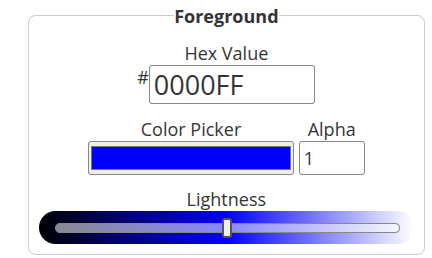

## Pràctica
Ara posarem en pràctica el que hem après en l’anterior apartat en la nostra pàgina web.

### Tasca 1
Ús de useRef: Creeu una funcionalitat a la pàgina web que utilitzi el hook useRef per a controlar un element DOM directament. Per exemple:
Implementar un botó que, en fer-hi clic, faci que el focus se situï en un formulari o element específic de la pàgina.
O, si ja teniu algun formulari, feu que un input tingui focus automàtic quan la pàgina es carrega.
Nota: Recordeu que el hook useRef no provoca que el component es torni a renderitzar quan el valor canviï, així que això és útil quan necessiteu interaccionar amb elements del DOM sense afectar l'estat de la interfície d'usuari.

[Visualización de la tasca](src/pages/SobreNosotros.jsx)

### Tasca 2
Integració d'ARIA:
Incloeu atributs ARIA en algun dels components o formularis de la vostra pàgina per millorar l'accessibilitat. Per exemple:
Afegir aria-label als inputs per proporcionar FontColors de la funció del camp.
Utilitzar role="button" per millorar l'ús d'elements que no són botons però actuïn com a tal.
Exemple: Si teniu un menú de navegació, podeu afegir atributs ARIA per indicar que és una barra de navegació: role="navigation".

[Visualización de la tasca](src/components/header.jsx)

Aplicació de les WCAG:
Expliqueu com les WCAG poden millorar la vostra pàgina i com apliquen les directrius en el vostre cas.
Revisa el contrast de colors de la vostra pàgina i assegureu-vos que compleixi amb els requisits WCAG.
Proveu d’aplicar altres millores relacionades amb les WCAG, com la navegabilitat del teclat (per exemple, afegir tabindex en elements interactius).

La aplicación de las WCAG es fundamental porque:

- Mejora la experiencia de todos los usuarios, no solo de las personas con discapacidad.
- Permite que lectores de pantalla y tecnologías asistivas interpreten correctamente la página.
- Ayuda a que tu proyecto cumpla con los estándares legales y profesionales vigentes.

### Ejemplo aplicado en mi página:

- Los atributos ARIA (como `aria-label`, `aria-expanded` y `role`) permiten que los lectores de pantalla identifiquen menús, botones e inputs de forma adecuada.
- Los inputs con etiquetas (`labels`) y el atributo `aria-required` informan a los usuarios cuáles campos son obligatorios.
- Los mensajes dinámicos, usando `role="status"` y `aria-live`, anuncian cambios en tiempo real, como el contador o la confirmación del envío del formulario.

---

## Uso de la página web

Para comprobar el contraste de colores he utilizado la herramienta [WCAG Contrast Checker de WebAIM](https://webaim.org/resources/contrastchecker/).

A continuación, se realiza la comprobación del contraste entre el texto (Foreground) y los fondos (Background):

**Fuente:**  

**Fondo:**  

En mi caso, al usar Tailwind CSS, convertí los colores a formato hexadecimal mediante un conversor:

[Conversor Tailwind a HEX Color](https://divmagic.com/es/tools/color-converter)

La primera prueba corresponde al fondo y título de la página "Sobre Nosotros".

**Primera prueba:**  

**Interpretación del test:**  
Aunque el texto pequeño no cumple con la proporción recomendada, el texto grande sí es válido y legible.

En la segunda prueba, el contraste del texto cumple con los requisitos, por lo que es adecuado para la accesibilidad.

### Tasca 3
Definició de Pàgina Web Responsiva
Feu la tria d’una part de la vostra pàgina web i feu que sigui responsive mitjançant media queries.
Creeu diversos punts de ruptura per a la pàgina mitjançant media queries. Per exemple:
Si la pàgina té una barra lateral, feu que aquesta desaparegui en pantalles petites i s'acumuli en un menú de tipus hamburguesa.
Canvieu l'estructura de la pàgina en funció de la mida de la pantalla (canvi de mides de font, disposició de les imatges, etc.).
Test de la Responsivitat
Comproveu que la pàgina s'adapti correctament a diferents mides de pantalla mitjançant eines de desenvolupament del navegador (inspector de dispositius).

## Definición de Página Web Responsiva

He implementado la responsividad en la página "Sobre Nosotros" mediante media queries usando Tailwind CSS. 

- La estructura cambia según el tamaño de pantalla: en dispositivos pequeños (móviles) la página se muestra en una sola columna, y en dispositivos medianos o más grandes se muestra en dos columnas con la clase `md:grid-cols-2`.
- El contenedor principal tiene un ancho máximo y está centrado (`max-w-screen-lg mx-auto`), para evitar que el contenido se estire demasiado en pantallas grandes.
- Para la navegación y otros elementos, he aplicado menús tipo hamburguesa que aparecen en pantallas pequeñas para mejorar la experiencia móvil.
- También se ajustan tamaños de fuentes y espacios con clases responsivas para mantener legibilidad y orden.

El navegador también es responsive y utilizó un menú hamrguesa para que no irrumpa con el contenido principal de la pàgina.  

### Test de Responsividad

He comprobado el correcto comportamiento con las herramientas de desarrollo del navegador (modo dispositivo). El contenido se adapta adecuadamente sin perder funcionalidad ni legibilidad en distintos tamaños desde móvil hasta escritorio.

---

Puedo ayudarte a añadir un fragmento CSS concreto si prefieres usar media queries manualmente, o ayudarte a ampliar la funcionalidad del menú hamburguesa si quieres.
